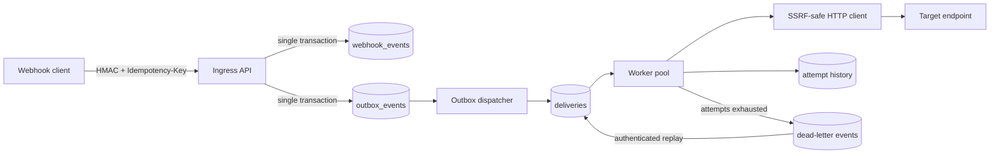

# Durable Webhook Delivery

[](https://github.com/German4341374/durable-webhook-delivery/actions/workflows/ci.yml)
[](https://go.dev/)
[](https://www.postgresql.org/)
[](LICENSE)

A compact webhook ingress and delivery service built around durable at-least-once processing, a PostgreSQL transactional outbox, controlled retries, and practical outbound-request security.

## Features

- channels with AES-256-GCM encrypted webhook secrets
- inbound and outbound HMAC-SHA256 signatures
- required per-channel idempotency keys
- event and outbox insert in one PostgreSQL transaction
- concurrent outbox dispatcher and delivery workers using `FOR UPDATE SKIP LOCKED`
- exponential backoff with full cryptographic jitter
- dead-letter state and authenticated manual replay
- per-target rate limits and concurrency limits
- durable delivery and attempt history
- worker leases that recover interrupted deliveries
- Prometheus text metrics and independent liveness/readiness endpoints
- 1 MiB default payload limit, timeouts, disabled redirects, masked headers
- SSRF prevention with HTTPS-only production policy and DNS-rebinding-resistant dialing
- controlled receiver scenarios for HTTP 500, timeout, duplicate input, PostgreSQL restart, and worker restart

## Architecture



The API and worker are separate processes sharing PostgreSQL. An accepted response means both the event and outbox row committed. It does not mean the target has received the webhook.

## Delivery guarantees

The system provides **at-least-once delivery**, not exactly once. A worker claims a durable lease, performs the HTTP request, then records the result. If it is terminated after the target accepts the request but before PostgreSQL records success, the lease expires and another worker sends the same event again. Targets must deduplicate using `X-Webhook-Event-ID` or their own business key.

Inbound duplicates are suppressed by the unique `(channel_id, idempotency_key)` constraint. The API returns the original event ID with `"duplicate": true`; it does not create a second outbox row. See [delivery guarantees](docs/delivery-guarantees.md).

## Security model

- Channel secrets are encrypted using AES-256-GCM. The channel ID is authenticated additional data, preventing ciphertext substitution between channels.
- The 32-byte master key, database password, admin token, and demo webhook secret are generated locally into ignored `.env`.
- Management endpoints require a constant-time checked `X-Admin-Token`. Webhook ingestion uses its channel HMAC.
- Production targets must use HTTPS. HTTP and private targets are enabled only by the explicit local demonstration flag.
- Target hostnames are resolved and every returned address is checked. The connection is made to the checked address while TLS still validates the original hostname, reducing DNS rebinding exposure.
- Loopback, RFC1918/private, link-local, multicast, unspecified addresses, URL credentials, redirects, and proxy environment variables are blocked in production mode.
- Authorization, cookies, signatures, token/key headers, and the admin token are masked before structured logging or header persistence.

Read the complete [security model and remaining risks](docs/security-model.md).

## Prerequisites

- Windows with WSL2 or Linux
- Docker Engine and Docker Compose v2
- Bash, `curl`, `jq`, and OpenSSL for controlled scenarios
- Go 1.26.5 for host development

No cloud account or external receiver is required.

## Start locally

```bash
git clone https://github.com/German4341374/durable-webhook-delivery.git
cd durable-webhook-delivery
make setup
make up
curl --fail http://127.0.0.1:8080/health/ready
```

`make setup` creates `.env` with random local credentials and mode `0600` through `umask`. Never copy the demonstration settings to production. Compose keeps PostgreSQL on a private database network. A separate edge network publishes the API and demo receiver to localhost and gives the worker the egress it needs for deliveries.

## API example

Load local secrets and create a channel:

```bash
set -a; source .env; set +a
curl --fail -X POST http://127.0.0.1:8080/api/channels \
  -H 'Content-Type: application/json' \
  -H "X-Admin-Token: $ADMIN_TOKEN" \
  -d "{\"name\":\"orders\",\"target_url\":\"http://receiver:8081/success\",\"secret\":\"$DEMO_WEBHOOK_SECRET\",\"timeout_ms\":2000,\"max_attempts\":5,\"rate_limit_per_second\":10,\"max_concurrency\":2}"
```

Sign and ingest a webhook:

```bash
body='{"order_id":"demo-1001","status":"paid"}'
signature="$(printf '%s' "$body" | openssl dgst -sha256 -hmac "$DEMO_WEBHOOK_SECRET" -hex | awk '{print $NF}')"
curl --fail -X POST http://127.0.0.1:8080/webhooks/orders \
  -H 'Content-Type: application/json' \
  -H 'Idempotency-Key: order-demo-1001-paid' \
  -H "X-Webhook-Signature: sha256=$signature" \
  -d "$body"
```

Inspect history or replay a dead letter:

```bash
curl --fail -H "X-Admin-Token: $ADMIN_TOKEN" 'http://127.0.0.1:8080/api/deliveries?limit=20'
curl --fail -H "X-Admin-Token: $ADMIN_TOKEN" http://127.0.0.1:8080/api/deliveries/DELIVERY_ID
curl --fail -X POST -H "X-Admin-Token: $ADMIN_TOKEN" http://127.0.0.1:8080/api/deliveries/DELIVERY_ID/replay
```

### Endpoints

| Method | Path | Protection | Purpose |
| --- | --- | --- | --- |
| POST | `/webhooks/{channel}` | Channel HMAC | Commit an event and outbox row |
| POST | `/api/channels` | Admin token | Create an encrypted channel |
| GET | `/api/channels` | Admin token | List safe channel metadata |
| GET | `/api/deliveries` | Admin token | Paginated delivery history |
| GET | `/api/deliveries/{id}` | Admin token | Delivery and every attempt |
| POST | `/api/deliveries/{id}/replay` | Admin token | Replay a dead letter |
| GET | `/health/live` | None | API process liveness |
| GET | `/health/ready` | None | API PostgreSQL readiness |
| GET | `/metrics` | None | API Prometheus metrics |

Worker health and metrics are exposed locally on port 9090. Protect health and metrics at the network layer outside this demonstration.

## Retry policy

Network failures, timeouts, HTTP 408, HTTP 429, and 5xx responses are retried. Other 4xx responses are permanent failures. Full jitter chooses a random delay between zero and `min(2^(attempt-1) seconds, 1 hour)`. When the configured attempt budget is exhausted, the delivery and an immutable dead-letter record are stored. Manual replay starts a new attempt cycle while preserving total attempts and history.

## Controlled failure demonstration

```bash
make scenarios
```

The script builds the images and proves all five requested cases using assertions against both the API and PostgreSQL. Details and expected recovery are in [controlled scenarios](docs/controlled-scenarios.md).

## Metrics

```bash
curl http://127.0.0.1:8080/metrics
curl http://127.0.0.1:9090/metrics
```

Counters cover received events, duplicates, successful deliveries, failed attempts, scheduled retries, dead letters, and manual replays. The worker also exposes an active-worker gauge. Metrics are process-local and reset on restart; PostgreSQL history is the durable source of truth.

## Development and verification

```bash
make fmt
make lint
make test
make test-race       # Linux/WSL with CGO support
make build
make scenarios
```

GitHub Actions runs gofmt, `go vet`, race-enabled unit/integration tests against PostgreSQL 18, both binary builds, the multi-stage container build, and all controlled failure scenarios.

## Failure recovery

- **PostgreSQL unavailable:** readiness becomes 503; ingestion does not return success; worker loops retry database operations without losing committed rows.
- **Worker stops before HTTP:** its lease expires and the delivery returns to `retry`.
- **Worker stops after target success:** the request may be sent again, which is the unavoidable at-least-once duplicate window.
- **Outbox dispatcher stops:** committed outbox rows remain undispatched and are claimed after restart.
- **Target fails:** attempts and errors are durable; retry or dead-letter policy continues after restart.
- **Master key lost:** encrypted secrets cannot be recovered. Restore the key from the approved secret backup or replace channel secrets.

See the [operations runbook](docs/runbook.md).

## Limitations

- Rate and concurrency controllers are process-local; run one worker service or use a distributed limiter before horizontal scaling.
- Metrics are process-local and should be scraped before restart.
- Master-key rotation and re-encryption are not implemented.
- The local Compose flag allows private HTTP receiver targets and must never be enabled in production.
- Management uses one static admin token, suitable for a compact internal demo but not multi-user authorization.
- Payloads are stored to support retries; database encryption, retention, and data classification remain deployment responsibilities.
- There is no UI, event transformation, fan-out, or cloud integration.

## Repository layout

```text
cmd/                    API/worker binary and controlled receiver
internal/api/           HTTP ingress and management API
internal/database/      migrations, outbox, leases, history, replay
internal/delivery/      workers, backoff, rate and concurrency limits
internal/security/      SSRF policy, safe dialing, header masking
migrations/             PostgreSQL schema
scripts/                local setup and controlled scenarios
docs/                   guarantees, security, scenarios, and runbook
.github/workflows/      race/integration tests and end-to-end scenarios
```

## License

[MIT](LICENSE)
